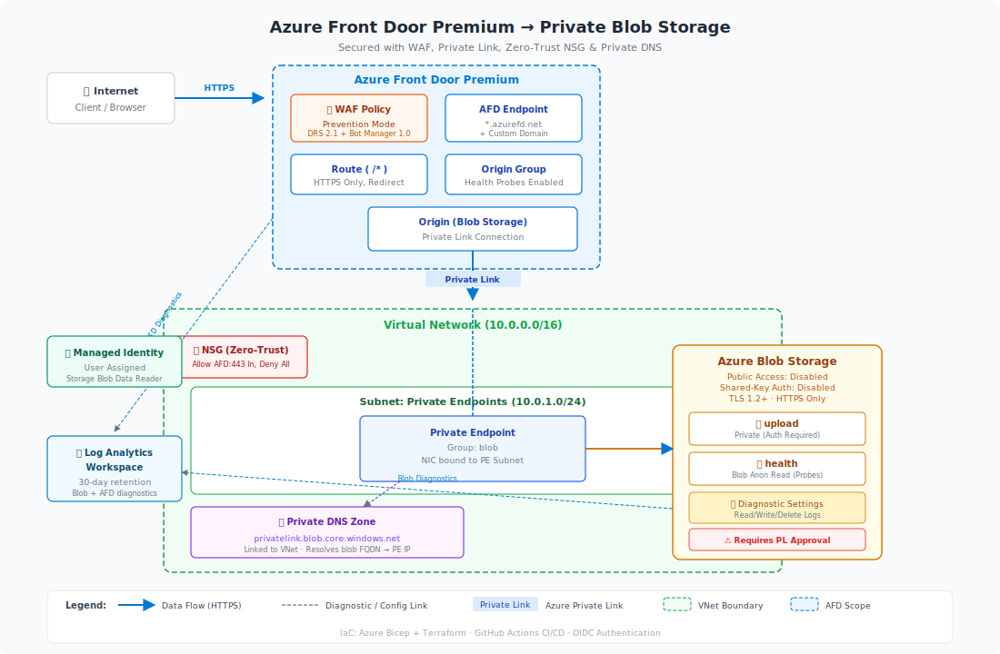

# Azure Front Door Premium → Private Blob Storage

This repository contains Infrastructure-as-Code (IaC) — in both **Azure Bicep** and **Terraform** — for deploying Azure Front Door Premium with WAF that routes to an Azure Blob Storage account exposed exclusively via a Private Endpoint.

## Architecture Overview



### Deployed Resources

| Resource | Bicep Module | Terraform Module | Purpose |
|---|---|---|---|
| Azure Front Door Premium | `modules/frontDoor/frontDoor.bicep` | `modules/front_door/` | Global load balancer, TLS termination, caching |
| WAF Policy (Prevention Mode) | `modules/frontDoor/wafPolicy.bicep` | `modules/front_door/` | OWASP + Bot Manager managed rule sets |
| Custom Domain + Route | `modules/frontDoor/frontDoor.bicep` | `modules/front_door/` | Routes requests to the blob origin |
| Origin Group + Origin | `modules/frontDoor/frontDoor.bicep` | `modules/front_door/` | Points AFD to storage via Private Link |
| Storage Account | `modules/storage/storageAccount.bicep` | `modules/storage/` | Blob storage, public network access disabled |
| Private Endpoint | `modules/networking/privateEndpoint.bicep` | `modules/private_endpoint/` | Connects storage into the VNet |
| Virtual Network + Subnet | `modules/networking/virtualNetwork.bicep` | `modules/networking/` | Hosts the private endpoint NIC |
| Network Security Group | `modules/networking/networkSecurityGroup.bicep` | `modules/nsg/` | Zero-trust NSG on the PE subnet — allows only AFD backend HTTPS inbound |
| Private DNS Zone | `modules/networking/privateDnsZone.bicep` | `modules/private_dns/` | Resolves storage FQDN to private IP |
| Log Analytics Workspace | `modules/monitoring/logAnalyticsWorkspace.bicep` | `modules/monitoring/` | Centralised diagnostic logs and metrics |

All modules use **Azure Verified Modules (AVM)** as the implementation foundation, with the exception of the Terraform Front Door module which uses native `azurerm_cdn_frontdoor_*` resources due to a lifecycle issue in the AVM CDN module (v0.1.9) that causes a destroy/recreate cycle on every apply. Environment-specific values are supplied via `src/bicep/parameters/main.dev.bicepparam` (Bicep) and `src/terraform/terraform.tfvars` (Terraform).

---

## Prerequisites

- Azure subscription with Contributor + User Access Administrator rights
- [Azure CLI](https://learn.microsoft.com/cli/azure/install-azure-cli) ≥ 2.55
- [Bicep CLI](https://learn.microsoft.com/azure/azure-resource-manager/bicep/install) ≥ 0.25 *(for Bicep track)*
- [Terraform](https://developer.hashicorp.com/terraform/install) ≥ 1.7 *(for Terraform track)*
- GitHub repository environment secrets configured for OIDC authentication

---

## Repository Structure

```
.
├── .github/
│   ├── agents/                  # Copilot custom coding agents
│   │   ├── azure.md             # Azure WAF/CAF alignment agent
│   │   ├── bicep.md             # Bicep IaC agent
│   │   ├── debugger.md          # Diagnostics and troubleshooting agent
│   │   ├── documentation.md     # Documentation agent
│   │   ├── github-actions.md    # GitHub Actions CI/CD agent
│   │   ├── planning.md          # Planning agent
│   │   └── terraform.md         # Terraform IaC agent
│   ├── workflows/               # GitHub Actions CI/CD workflows
│   └── copilot-instructions.md  # Project-wide Copilot instructions
├── src/
│   ├── bicep/                   # Bicep modules + main deployment
│   │   ├── modules/
│   │   │   ├── frontDoor/       # AFD Premium profile + WAF policy (AVM)
│   │   │   ├── monitoring/      # Log Analytics Workspace (AVM)
│   │   │   ├── networking/      # VNet, NSG, Private Endpoint, Private DNS (AVM)
│   │   │   └── storage/         # Storage account (AVM)
│   │   ├── parameters/
│   │   │   └── main.dev.bicepparam
│   │   └── main.bicep
│   └── terraform/               # Terraform root module + child modules
│       ├── modules/
│       │   ├── front_door/      # AFD Premium profile + WAF policy (native azurerm)
│       │   ├── monitoring/      # Log Analytics Workspace (AVM)
│       │   ├── networking/      # VNet + PE subnet (AVM)
│       │   ├── nsg/             # Network Security Group (AVM)
│       │   ├── private_dns/     # Private DNS zone + VNet link (AVM)
│       │   ├── private_endpoint/ # Private endpoint + NIC (AVM)
│       │   └── storage/         # Storage account (AVM)
│       ├── main.tf
│       ├── variables.tf
│       ├── outputs.tf
│       ├── providers.tf
│       └── terraform.tfvars
└── README.md
```

---

## CI/CD Setup

The GitHub Actions workflow automates linting and deployment of both the Bicep and Terraform tracks. Authentication to Azure uses **OIDC / Workload Identity Federation** — no client secrets or long-lived credentials are ever stored in GitHub.

### Overview

- **Single workflow file:** `.github/workflows/deploy.yml`
- **Bicep** deploys to its own Azure resource group; **Terraform** deploys to a separate resource group — both can coexist in the same subscription without naming conflicts.
- **No stored secrets:** the workflow exchanges GitHub's short-lived OIDC token for an Azure access token at runtime.
- **Triggers:** `push` to `main` (full deploy), `pull_request` (lint / validate only), `workflow_dispatch` (manual deploy).

### Choosing What to Deploy — Bicep, Terraform, or Both

The workflow supports deploying **Bicep only**, **Terraform only**, or **both** stacks. This is controlled by a single `deploy_target` value that accepts three options: `both`, `bicep`, or `terraform`.

#### Manual runs (workflow_dispatch)

When you trigger the workflow manually via **Actions → Run workflow**, a **"IaC stack(s) to lint and deploy"** dropdown lets you choose:

| Option | Effect |
|---|---|
| `both` *(default)* | Lint and deploy both Bicep **and** Terraform |
| `bicep` | Lint and deploy **only** Bicep |
| `terraform` | Lint and deploy **only** Terraform |

#### Automated runs (push / pull_request)

For automated triggers (`push` to `main` or `pull_request`), the workflow reads the **optional** repository variable `DEPLOY_TARGET`:

- Set `DEPLOY_TARGET` to `bicep`, `terraform`, or `both` under **Settings → Secrets and variables → Variables → Repository variables**.
- If the variable is **not set**, the workflow defaults to `both`.

```bash
# Example: restrict automated CI/CD runs to Terraform only
gh variable set DEPLOY_TARGET --body "terraform"
```

> **Override rule:** The `workflow_dispatch` dropdown always takes precedence over the repository variable. This lets you do a one-off deploy of a specific stack without changing the repo-wide default.

Each workflow job evaluates the effective `deploy_target` value and **skips** when it doesn't match. For example, setting `deploy_target` to `bicep` causes the Terraform lint and deploy jobs to be skipped entirely.

---

### Step 1 — Create a Federated Identity for OIDC

Create an identity that GitHub Actions will impersonate via OIDC. You can use either a **User-Assigned Managed Identity** or an **App Registration (Service Principal)**; the `azure/login@v2` action's `client-id` input accepts either. The examples below use a User-Assigned Managed Identity.

```bash
# Create a resource group to hold the identity (or use an existing one)
az group create --name rg-github-oidc --location eastus

# Create the User-Assigned Managed Identity
az identity create \
  --name mi-github-afd-blob-storage \
  --resource-group rg-github-oidc \
  --location eastus
```

Capture the `clientId` and `principalId` for use in later steps:

```bash
CLIENT_ID=$(az identity show \
  --name mi-github-afd-blob-storage \
  --resource-group rg-github-oidc \
  --query clientId -o tsv)

PRINCIPAL_ID=$(az identity show \
  --name mi-github-afd-blob-storage \
  --resource-group rg-github-oidc \
  --query principalId -o tsv)
```

Assign the **Contributor** role so the identity can create resource groups and resources:

```bash
SUBSCRIPTION_ID=$(az account show --query id -o tsv)

az role assignment create \
  --assignee-object-id "$PRINCIPAL_ID" \
  --assignee-principal-type ServicePrincipal \
  --role Contributor \
  --scope "/subscriptions/$SUBSCRIPTION_ID"
```

> **Least-privilege tip:** For tighter security, scope the role assignment to the specific resource groups (`rg-afdblobbic-dev-cus` for Bicep and your Terraform RG) rather than the full subscription. Subscription-level Contributor is simpler for initial setup.

---

### Step 2 — Configure Federated Credentials (OIDC)

Federated credentials allow GitHub Actions to exchange a short-lived OIDC token for an Azure access token. No password or client secret is ever stored in GitHub or Azure.

Create **three** federated credentials — one for `push` to `main`, one for `pull_request`, and one for `workflow_dispatch` (environment-scoped):

```bash
# Credential for push to main (used by deploy jobs)
az identity federated-credential create \
  --name fc-github-main \
  --identity-name mi-github-afd-blob-storage \
  --resource-group rg-github-oidc \
  --issuer "https://token.actions.githubusercontent.com" \
  --subject "repo:christopherhouse/Afd-Blob-Storage:ref:refs/heads/main" \
  --audiences "api://AzureADTokenExchange"

# Credential for pull requests (used by lint jobs that also call azure/login)
az identity federated-credential create \
  --name fc-github-pr \
  --identity-name mi-github-afd-blob-storage \
  --resource-group rg-github-oidc \
  --issuer "https://token.actions.githubusercontent.com" \
  --subject "repo:christopherhouse/Afd-Blob-Storage:pull_request" \
  --audiences "api://AzureADTokenExchange"

# Credential for manual workflow_dispatch runs (environment-scoped)
az identity federated-credential create \
  --name fc-github-dispatch \
  --identity-name mi-github-afd-blob-storage \
  --resource-group rg-github-oidc \
  --issuer "https://token.actions.githubusercontent.com" \
  --subject "repo:christopherhouse/Afd-Blob-Storage:environment:dev" \
  --audiences "api://AzureADTokenExchange"
```

> Replace `christopherhouse/Afd-Blob-Storage` with your `{org}/{repo}` if you fork this repository.

The environment-scoped credential (`environment:dev`) is what authorises the **deploy jobs**, which run with `environment: dev` in the workflow.

---

### Step 3 — Set up Terraform State Storage

Terraform state is stored in Azure Blob Storage. The backend uses **OIDC authentication** — no storage account access keys are stored or used.

**Create the state storage resources:**

```bash
# Variables — customise to match your naming convention
TF_STATE_RG="rg-tfstate-dev"
TF_STATE_SA="stafdblobstate$(openssl rand -hex 3)"   # must be globally unique
TF_STATE_CONTAINER="tfstate"

# Resource group for state storage
az group create --name "$TF_STATE_RG" --location eastus

# Storage account — Standard_LRS is appropriate for a dev state backend.
# Use Standard_ZRS or geo-redundant SKUs for production state storage.
az storage account create \
  --name "$TF_STATE_SA" \
  --resource-group "$TF_STATE_RG" \
  --location eastus \
  --sku Standard_LRS \
  --kind StorageV2 \
  --allow-blob-public-access false \
  --min-tls-version TLS1_2

# Blob container for state files
az storage container create \
  --name "$TF_STATE_CONTAINER" \
  --account-name "$TF_STATE_SA" \
  --auth-mode login
```

**Grant the federated identity access to the state storage:**

```bash
# Storage Blob Data Contributor allows Terraform to read/write state blobs
az role assignment create \
  --assignee-object-id "$PRINCIPAL_ID" \
  --assignee-principal-type ServicePrincipal \
  --role "Storage Blob Data Contributor" \
  --scope "$(az storage account show \
      --name "$TF_STATE_SA" \
      --resource-group "$TF_STATE_RG" \
      --query id -o tsv)"
```

> The `providers.tf` backend block is an empty `backend "azurerm" {}` declaration — all configuration is supplied at runtime via `-backend-config` flags (see the workflow's "Terraform init" step). `use_oidc = true` is passed as a backend-config flag, ensuring no storage account access keys are ever used or stored.

---

### Step 4 — Configure GitHub Repository Variables

All workflow configuration is stored as **GitHub Variables** (not secrets), since none of these values are sensitive credentials.

**Repository-level variables** (Settings → Secrets and variables → Variables → Repository variables):

| Variable | Description | Example |
|---|---|---|
| `AZURE_CLIENT_ID` | Application (client) ID of the federated identity | `xxxxxxxx-xxxx-xxxx-xxxx-xxxxxxxxxxxx` |
| `AZURE_TENANT_ID` | Azure AD Tenant ID | `xxxxxxxx-xxxx-xxxx-xxxx-xxxxxxxxxxxx` |
| `AZURE_SUBSCRIPTION_ID` | Target Azure Subscription ID | `xxxxxxxx-xxxx-xxxx-xxxx-xxxxxxxxxxxx` |
| `AZURE_LOCATION` | Primary Azure region | `eastus` |
| `DEPLOY_TARGET` *(optional)* | Default IaC stack for push/PR triggers: `bicep`, `terraform`, or `both` (defaults to `both` when unset; overridden by the workflow_dispatch dropdown) | `both` |

**`dev` environment variables** (Settings → Environments → dev → Environment variables):

| Variable | Description | Example |
|---|---|---|
| `BICEP_RESOURCE_GROUP` | Resource group for the Bicep deployment | `rg-afdblobbic-dev-cus` |
| `TF_STATE_RESOURCE_GROUP` | Resource group holding TF state storage | `rg-tfstate-dev` |
| `TF_RESOURCE_GROUP` | Pre-existing resource group for the Terraform deployment | `rg-afdblobtf-dev` |
| `TF_STATE_STORAGE_ACCOUNT` | Storage account name for TF state | `stafdblobstateabc123` |
| `TF_STATE_CONTAINER` | Blob container name for TF state files | `tfstate` |

Use the `gh` CLI to set all variables at once:

```bash
# Retrieve values captured in earlier steps
TENANT_ID=$(az account show --query tenantId -o tsv)
SUBSCRIPTION_ID=$(az account show --query id -o tsv)
CLIENT_ID=$(az identity show \
  --name mi-github-afd-blob-storage \
  --resource-group rg-github-oidc \
  --query clientId -o tsv)

# Set repository-level variables
gh variable set AZURE_CLIENT_ID       --body "$CLIENT_ID"
gh variable set AZURE_TENANT_ID       --body "$TENANT_ID"
gh variable set AZURE_SUBSCRIPTION_ID --body "$SUBSCRIPTION_ID"
gh variable set AZURE_LOCATION        --body "eastus"

# Set dev environment variables
gh variable set BICEP_RESOURCE_GROUP      --env dev --body "rg-afdblobbic-dev-cus"
gh variable set TF_STATE_RESOURCE_GROUP   --env dev --body "$TF_STATE_RG"
gh variable set TF_RESOURCE_GROUP         --env dev --body "rg-afdblobtf-dev"
gh variable set TF_STATE_STORAGE_ACCOUNT  --env dev --body "$TF_STATE_SA"
gh variable set TF_STATE_CONTAINER        --env dev --body "$TF_STATE_CONTAINER"
```

---

### Step 5 — Create the `dev` GitHub Environment

1. In your repository go to **Settings → Environments → New environment**.
2. Name the environment **`dev`**.
3. Optionally configure **protection rules** (e.g., required reviewers) to gate deployments — recommended when promoting this pattern to a production environment.

The workflow deploy jobs reference `environment: dev`, which ties them to this environment's variables and any protection rules you configure.

---

### Resource Naming — Avoiding Clashes

The Bicep and Terraform deployments intentionally use distinct `workloadName` / `workload_name` values so that both tracks can be deployed to the same Azure subscription without storage account or other globally-unique name conflicts:

| IaC Tool | `workloadName` / `workload_name` | Example Storage Account Name |
|---|---|---|
| Bicep | `afdblobbic` | `stafdblobbicdevcus` |
| Terraform | `afdblobtf` | `stafdblobtfdevcus` |

Both stacks can coexist in the same subscription simultaneously.

---

## Post-Deployment Steps

After deploying (via either Bicep or Terraform), two manual steps are required before Azure Front Door can serve traffic to the storage account.

### Step 1 — Create the Health Probe File

This solution configures the AFD health probe to check the path `/health/health.txt` on the storage account origin. Create an empty file named `health.txt` in the **health** container so the probe can issue HTTP HEAD requests against it. The file can be empty — its contents are never read; AFD only needs the file to exist and return a successful response. See the [AFD Health Probes](#afd-health-probes) section below for a detailed explanation of the health probe configuration and why it works this way.

> **Note:** Because the storage account has public network access disabled, you must have network connectivity to the storage account's data plane to upload the blob. This typically means running the upload from a machine that has access to the VNet (e.g., via VPN, ExpressRoute, a jump box inside the VNet, or Azure Cloud Shell with VNet integration).

You can create the file via Azure CLI:

```bash
# Create an empty health.txt blob in the 'health' container
az storage blob upload \
  --account-name <storage-account-name> \
  --container-name health \
  --name health.txt \
  --data "" \
  --auth-mode login
```

Or via the Azure Portal:

1. Navigate to your **Storage Account** → **Containers** → **health**.
2. Click **Upload** and select (or create) an empty file named `health.txt`.

### Step 2 — Approve the AFD Private Link Connection

The Private Link connection from Azure Front Door to the storage account starts in a **Pending** state. **Traffic will not flow through AFD to storage until this connection is explicitly approved.**

#### Why approval is required

Azure Front Door initiates a Private Link connection to the storage account's private endpoint. Because this connection crosses trust boundaries, Azure requires a storage account owner to manually approve it before traffic can flow.

#### Approve via Azure Portal

1. Navigate to your **Storage Account** in the Azure Portal.
2. Select **Networking** → **Private endpoint connections**.
3. Find the connection with a description referencing **Azure Front Door** (the status will show **Pending**).
4. Select the connection and click **Approve**.
5. Confirm the approval in the dialog.

#### Approve via Azure CLI

```bash
# Get the pending private endpoint connection name
az storage account show \
  --name <storage-account-name> \
  --resource-group <resource-group-name> \
  --query "privateEndpointConnections[?privateLinkServiceConnectionState.status=='Pending'].name" \
  -o tsv

# Approve the connection (substitute the name returned above)
az storage account private-endpoint-connection approve \
  --account-name <storage-account-name> \
  --resource-group <resource-group-name> \
  --name <connection-name>
```

> **Note:** DNS propagation and AFD origin health checks may take a few minutes to complete after approval. Monitor the AFD origin health in the Azure Portal under **Azure Front Door → Origin groups** to confirm the origin transitions to a **Healthy** state.

---

## AFD Health Probes

Azure Front Door uses health probes to determine whether each origin in an origin group is available and healthy. Understanding how health probes work with private blob storage origins is critical to a successful deployment.

### How Health Probes Work

When enabled (`enableFrontDoorHealthProbe = true` in Bicep / `enable_front_door_health_probe = true` in Terraform), the AFD origin group is configured with a health probe that periodically sends an HTTPS `HEAD` request to:

```
/health/health.txt
```

The probe interval is **100 seconds** (Bicep) or **30 seconds** (Terraform) — the values differ because each IaC track can be tuned independently; adjust the interval in the respective module to match your availability requirements. The origin group's load balancer evaluates health based on a sample of **4 probes**, requiring **3 successful responses** within a **50 ms additional-latency window** to consider the origin healthy.

When the health probe is **disabled**, the origin group's health probe settings are omitted entirely (`healthProbeSettings: null` in Bicep, empty `health_probe {}` block in Terraform), and AFD assumes the origin is always healthy.

### Why Anonymous Blob Access Is Required

**Azure Front Door does not support Managed Identity authentication over Private Link connections for health probes.** Because the storage account has public network access disabled, the health probe traffic traverses the Private Link, where MI-based authentication is unavailable.

To work around this limitation, the deployment:

1. **Creates a `health` container** in the storage account with **anonymous blob-level read access** (`publicAccess: 'Blob'`). This container is only created when the health probe is enabled.
2. **Sets `allowBlobPublicAccess: true`** (or `allow_nested_items_to_be_public = true` in Terraform) at the storage account level — but only when the health probe is enabled. This is required by Azure to permit anonymous access on individual containers.
3. **Keeps the `upload` container fully private** — anonymous access is scoped to the `health` container only.

After deployment, you must upload a small `health.txt` file to the `health` container so the probe has a resource to check:

```bash
echo "healthy" > /tmp/health.txt
az storage blob upload \
  --account-name <storage-account-name> \
  --container-name health \
  --name health.txt \
  --file /tmp/health.txt \
  --auth-mode login
```

### Security Risks of Anonymous Access

Enabling the health probe requires `allowBlobPublicAccess: true` (Bicep) or `allow_nested_items_to_be_public = true` (Terraform) at the **storage account level**. While anonymous read access is scoped to the `health` container only — and the `upload` container where actual content is stored remains fully private — there are important security considerations:

- **Account-level setting:** Setting `allowBlobPublicAccess` to `true` enables the *possibility* of anonymous access on any container in the storage account. If an administrator later creates a new container and inadvertently sets its access level to `Blob` or `Container`, that container's data would also be publicly readable.
- **Compliance and policy:** Many organisations enforce Azure Policy rules that deny storage accounts with `allowBlobPublicAccess = true`. Enabling the health probe will conflict with such policies.
- **Attack surface:** Even though the `health` container holds only a static `health.txt` file, any blob uploaded to that container is anonymously readable. Ensuring that only the intended health-check file exists in the container is an ongoing operational responsibility.

> **Recommendation:** Weigh the security risk of enabling anonymous blob access against the operational value provided by health probes. If your security posture or compliance requirements do not permit anonymous access on the storage account, **set `enableFrontDoorHealthProbe = false`** (Bicep) or **`enable_front_door_health_probe = false`** (Terraform) and forego health probes entirely. In this configuration, AFD will skip health checks and treat the origin as always healthy, which is an acceptable trade-off for many workloads — especially those with a single origin.

---

## Uploading Content with azcopy

While Azure Front Door paired with Blob Storage is most commonly associated with **web and CDN workloads** (serving static sites, media, or cached content at the edge), this pattern can also serve as an **external integration point** — allowing you to receive blob data from external entities or publish data for them to consume. In this scenario, **azcopy** provides a convenient way for external parties to send or receive files through the AFD-fronted storage account.

The example below demonstrates how to use azcopy to upload to a storage account using a **service principal** for authentication. Because the storage account has public network access disabled and shared-key access disabled, uploading content requires authentication via Microsoft Entra ID (Azure AD).

### Prerequisites

- [azcopy](https://learn.microsoft.com/azure/storage/common/storage-use-azcopy-v10) ≥ 10.x installed
- A service principal (app registration) with the **Storage Blob Data Contributor** role assigned on the target storage account or the `upload` container
- The service principal's tenant ID, application (client) ID, and client secret (or certificate)

### Authenticate azcopy with a Service Principal

Set the following environment variables before running azcopy. When all four variables are present, azcopy authenticates automatically — there is no need to run `azcopy login`:

| Variable | Value | Description |
|---|---|---|
| `AZCOPY_SPA_APPLICATION_ID` | `<app-registration-client-id>` | The Application (client) ID of the app registration |
| `AZCOPY_SPA_CLIENT_SECRET` | `<app-registration-client-secret>` | The client secret for the app registration |
| `AZCOPY_TENANT_ID` | `<entra-tenant-id>` | The Microsoft Entra (Azure AD) tenant ID |
| `AZCOPY_AUTO_LOGIN_TYPE` | `SPN` | Tells azcopy to authenticate as a service principal automatically |

```bash
export AZCOPY_SPA_APPLICATION_ID="<app-registration-client-id>"
export AZCOPY_SPA_CLIENT_SECRET="<app-registration-client-secret>"
export AZCOPY_TENANT_ID="<entra-tenant-id>"
export AZCOPY_AUTO_LOGIN_TYPE="SPN"
```

> **Tip:** Retrieve the client secret from Azure Key Vault at runtime rather than hard-coding it. Clear `AZCOPY_SPA_CLIENT_SECRET` from the environment after use.

### Upload Files

When uploading to a storage account that is fronted by Azure Front Door with a custom domain, you must include two additional arguments:

| Argument | Value | Why |
|---|---|---|
| `--from-to` | `LocalBlob` | Tells azcopy the transfer direction explicitly (local file system → Azure Blob Storage). Required for private storage accounts where automatic endpoint detection fails due to disabled public network access. |
| `--trusted-microsoft-suffixes` | Your AFD endpoint hostname or custom domain (e.g., `blob.christopher-house.com`) | Allows azcopy to trust the non-standard hostname for authentication token scoping. Without this flag, azcopy may refuse to send credentials to a hostname that doesn't match `*.blob.core.windows.net`. |

**Upload a single file:**

```bash
azcopy copy "./my-file.txt" \
  "https://<storage-account-name>.blob.core.windows.net/upload/my-file.txt" \
  --from-to LocalBlob \
  --trusted-microsoft-suffixes "<your-afd-or-custom-domain>"
```

**Upload an entire directory:**

```bash
azcopy copy "./my-folder" \
  "https://<storage-account-name>.blob.core.windows.net/upload/" \
  --from-to LocalBlob \
  --trusted-microsoft-suffixes "<your-afd-or-custom-domain>" \
  --recursive
```

> **Tip:** If your storage account is configured with a custom domain via Azure Front Door (e.g., `blob.christopher-house.com`), use that domain as the `--trusted-microsoft-suffixes` value. If you are only using the default `.azurefd.net` endpoint, use that hostname instead.

> **Note:** Because `shared_access_key_enabled` is set to `false` on the storage account, SAS tokens and storage account keys cannot be used for authentication. Service principal or managed identity authentication via Microsoft Entra ID is the only supported method.

---

## Contributing

See [`.github/copilot-instructions.md`](.github/copilot-instructions.md) for coding standards and conventions.

## References

- [Azure Front Door Private Link](https://learn.microsoft.com/azure/frontdoor/private-link)
- [CAF Naming Convention](https://learn.microsoft.com/azure/cloud-adoption-framework/ready/azure-best-practices/resource-naming)
- [Azure Verified Modules – Bicep](https://azure.github.io/Azure-Verified-Modules/)
- [Terraform AzureRM Provider](https://registry.terraform.io/providers/hashicorp/azurerm/latest/docs)
- [GitHub Actions OIDC with Azure](https://learn.microsoft.com/azure/developer/github/connect-from-azure)
